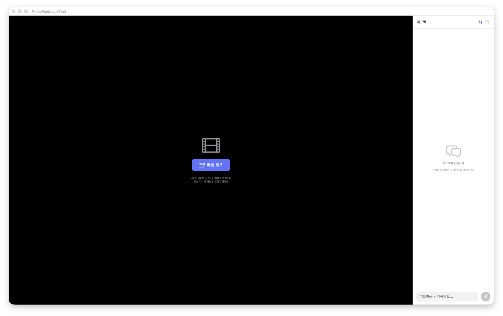

# Video Feedback Tool

영상 리뷰 중 현재 시점에 피드백을 빠르게 남기고, Notion 체크리스트로 복사할 수 있는 macOS 앱입니다.



## 주요 기능

- MP4, MOV, M4V 파일 열기 및 드래그 앤 드롭
- 재생 중 현재 타임스탬프와 함께 피드백 기록
- 피드백 클릭 시 해당 영상 시점으로 이동
- Notion To-do 체크리스트 형식으로 클립보드 내보내기
- 클립보드에 있는 Notion To-do 피드백 다시 불러오기
- 비디오 포커스 상태에서 `Space`, `←`, `→`, `Shift + ←/→` 재생 제어

## 다운로드

최신 DMG는 GitHub Releases에서 받을 수 있습니다.

[VideoFeedbackTool v1.2.1 다운로드](https://github.com/rifi97/video-feedback-tool/releases/tag/v1.2.1)

## 사용법

1. 앱을 실행하고 `파일 열기` 버튼을 누르거나 영상 파일을 창에 드래그합니다.
2. 영상을 보면서 오른쪽 입력칸에 피드백을 작성하고 Enter로 추가합니다.
3. 오른쪽 위 내보내기 버튼 또는 `Cmd + E`로 피드백을 클립보드에 복사합니다.
4. Notion에 붙여넣으면 체크리스트 형태로 정리됩니다.

## 단축키

| 단축키 | 기능 |
| --- | --- |
| `Space` | 재생 / 일시정지 |
| `←` | 1프레임 뒤로 이동 |
| `→` | 1프레임 앞으로 이동 |
| `Shift + ←` | 10프레임 뒤로 이동 |
| `Shift + →` | 10프레임 앞으로 이동 |
| `Cmd + E` | 피드백을 클립보드로 내보내기 |

## 개발

요구사항:

- macOS 14.0 이상
- Xcode

빌드:

```bash
open VideoFeedbackTool.xcodeproj
```

Xcode에서 `VideoFeedbackTool` scheme을 선택한 뒤 Build 또는 Run을 실행합니다.

CLI 빌드:

```bash
xcodebuild -project VideoFeedbackTool.xcodeproj -scheme VideoFeedbackTool -configuration Release build
```

## 릴리즈

배포용 DMG 파일은 저장소에 커밋하지 않고 GitHub Releases에 첨부합니다.
